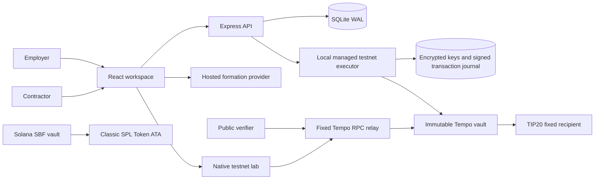

# Architecture

## Components

The main presentation workspace uses the API and native Tempo executor. Its vault, claims and recipient balances come from one verified chain block; local metadata records earned-work approval and company readiness. An explicit optional accounting simulation remains separate and never produces a native receipt. There is no pooled coverage across chains or assets.

## Payment state machine

`draft → approved → committed → paid`

A draft describes earned work. Approval records employer acceptance. Native commitment requires a confirmed managed test recipient and sufficient actual liquid reserves; the immutable contract fixes the recipient, amount and due time. Paid state requires the exact claim tuple to match the invoice. Permissionless settlement uses a distinct pre-funded caller. The optional simulation applies the same reserve rules transactionally in SQLite and identifies its references as simulated.

## Reserve accounting

For each native vault and exact asset, let `L` be liquid token balance, `P` unpaid committed principal, and `B` the operational buffer. Available surplus is `max(0, L − P − B)`. Monetary API values are decimal integer strings with six-decimal asset precision. JavaScript floating-point arithmetic is not used for money.

- New commitments, withdrawals and strategy allocations must preserve `L ≥ P + B`.
- Payment requires `L ≥ P`; a deficient buffer does not strand an otherwise fully covered worker entitlement.
- If `L < P`, all claims are blocked until principal coverage is restored. There is no first-claimant preference.
- Strategy value is excluded from liquid coverage. Recovery can return partial value even while reserves remain deficient.
- Retirement requires no unpaid principal. It permanently disallows new commitments and releases the buffer.
- Batches are atomic; a failed recipient does not partially update other claims. Independent individual claims remain available.

## Persistent API

Node 24's SQLite driver runs in WAL mode. Organization snapshots and idempotency fingerprints update within a transaction. Accounts use scrypt password hashes; session cookies hold random opaque tokens whose hashes are stored. A CSRF token and same-origin mutation check protect state changes. Worker queries and mutations are restricted to their assigned recipient identity. An invitation token is expiring, hashed and single-use.

Native money mutations require keys scoped by authenticated user. Repeating the same key and operation returns a reconciled snapshot; a different operation with the same key conflicts. Browser session storage preserves uncertain keys across refreshes. Each organization serializes money operations; cross-process wallet leases serialize transaction nonces. No SQLite transaction spans an RPC request.

The native journal saves a semantic fingerprint before preparation, then signed raw bytes and their hash before broadcast. Unknown outcomes retain the same bytes and nonce. Refresh/retry reconciles the receipt and exact chain claim. A receipt-proven revert can start another attempt using the same immutable claim ID, while preserving the previous attempt's public hash and bytes in the private journal. Confirmed payments never restart. Previously recorded commitments missing from the observed block fail verification and make the view stale.

## Native boundaries

The main Tempo executor generates persistent, encrypted, test-only wallets; it never imports a user's wallet. Windows uses CurrentUser DPAPI to protect the encryption master. The lab's separate experimental wallets remain in memory. Both the executor and unsigned RPC relay use fixed Moderato chain 42431, with writes restricted to loopback connection and browser origin. They verify pathUSD precision, supported executable code, fixed employer and no-strategy configuration. Immutable constructor slots are masked using the compiler's exact immutable references; altered executable instructions are rejected. Main presentation funding/deployment is prepared in advance; ordinary login/commit/claim contains no faucet call.

Chain reads are pinned to one block. A responsive endpoint is insufficient: the observed head must be at most 120 seconds behind the system clock and no more than 30 seconds ahead. Last-confirmed state is persisted with block number and check time. RPC failures or an old head preserve that view with a visible stale status and pause writes. Due eligibility still uses the actual block timestamp. Transaction hashes are from confirmed native receipts/events; a commitment hash is never reused as a settlement hash. Provider availability remains a real dependency.

The Solana program uses classic SPL Token, deterministic PDAs and the recipient's associated token account. Token-2022 extensions are unsupported. RPC, token issuer restrictions, chain availability and transaction fees remain external dependencies even when claim authorization is permissionless.

## Formation and cashout

Formation, tax identifier, KYB, bank account and payment route are distinct readiness states. The current formation action prepares a hosted link and records a handoff; it does not advance any approval state. A future approved cashout adapter must expose its own accepted, pending, delivered, failed and refunded statuses and reconciliation references. An onchain transfer alone cannot prove fiat delivery.

## Repository map

`src/` contains the client, shared types and native verification helpers. `server/` contains authentication, domain rules, storage and API. `contracts/` contains Tempo Solidity and executable EVM invariants. `programs/soleil/` contains the Solana program and proof tooling. `public/` contains compiled public contract metadata and public-only chain evidence. `scripts/` contains compilation, launch and test tooling. Secrets and mutable runtime databases never belong in public artifacts.
