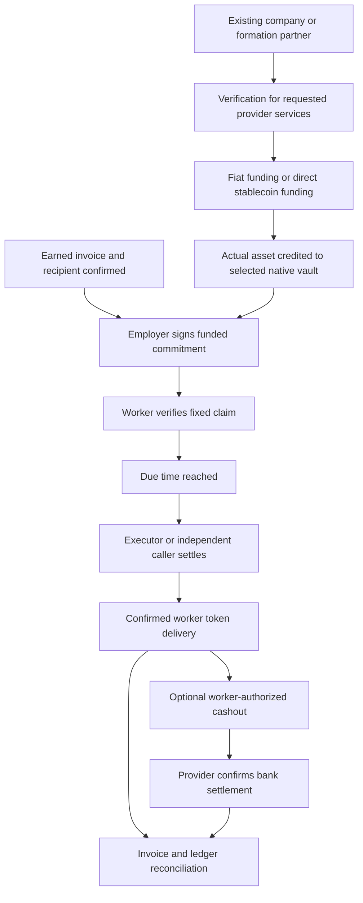
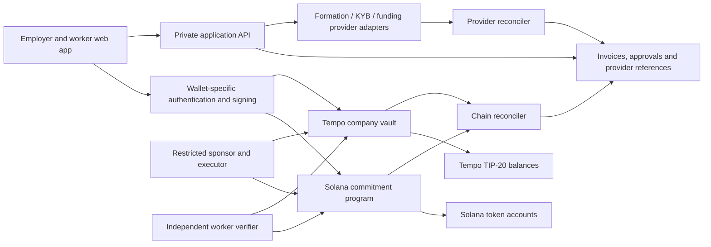

# Soleil — Product Requirements Document

**Decision:** Build a business workflow for approved contractor invoices with verifiable funding and independent payment claims. Use a native Solana commitment program as the recommended Colosseum core, and a separately funded native Tempo vault as the meaningful second rail. Offer incorporation and banking through actual providers. Keep yield secondary.

**Research checked:** October 1, 2026. **Status:** proposed product and technical specification; no implementation, commercial provider agreement, incorporation, audit or customer validation is implied. This document supersedes the earlier YieldPay-derived assessment. Priorities below reflect product dependencies, not dates or team size.

## 1. The product decision

Soleil helps a stablecoin-funded business approve contractor invoices, earmark the exact payment in a contract, show the contractor that funding, and settle at the agreed due time without depending on the finance operator being available.

The complete experience is:

> Use an existing company or form one through a partner → complete verification for requested provider services → fund a business wallet → approve an earned invoice → create a funded worker commitment → settle when due → optionally cash out → reconcile the business records.

The core promise is deliberately narrow: **the employer and Soleil cannot use an unpaid committed amount for withdrawal or investment, and a funded caller can settle it to the fixed recipient after maturity.** This depends on the deployed code and authorities, supported asset, chain operation and token restrictions. It is neither insurance nor a guarantee of fiat arrival, dollar value, bankruptcy treatment or immunity from bugs.

### Changes from YieldPay

| Original direction | Soleil decision | Reason |
|---|---|---|
| Upcoming payroll cycle | Approved, earned contractor invoices with actual payment terms | Avoid irreversibly locking money for work that has not been performed or accepted. |
| Employer presses “Pay everyone” | Operator automation plus permissionless fixed-recipient settlement | The worker's entitlement should not depend on one employer job or Soleil's server. |
| Payroll plus yield as headline | Invoice certainty and reliable reconciliation as headline | Payroll and yield already exist; the product needs a distinct customer benefit. |
| Tempo only | Solana core; substantive Tempo alternate | Align with the current accelerator's Solana condition while preserving Tempo's useful payments tooling. |
| Incorporation excluded | Optional partner formation, separately tracked | Formation belongs in the customer journey, but it is a legal service with its own approval process. |
| Generic fee reserve in vault | Fees and rent paid by caller or external sponsor | Worker principal should not be silently spent on execution. |

The attachment is background for the original concept, not an instruction to build every feature or reuse its submission text.

## 2. Customer and reason to buy

### First customer hypothesis

An agency, studio or services business that already receives stablecoins, pays cross-border contractors, and approves invoices under genuine net payment terms. It currently coordinates invoices, wallet addresses, payout spreadsheets and payment-status messages.

The buyer is the owner or finance operator. The contractor is the beneficiary. A formation provider can be a distribution partner, but company formation is optional: an existing entity must be able to use Soleil.

The employer buys fewer payment mistakes, less manual reconciliation, fewer “will I be paid?” messages, reliable execution despite operator absence, and an accurate view of cash remaining available. The worker gets a funding receipt that can be checked independently and a direct settlement route.

**The hard objection:** if an invoice is earned, accepted and the company has the cash, why not pay immediately? Locking money sacrifices flexibility and does not improve the employer's capital efficiency. Soleil must beat immediate payment, a scheduled transfer and existing escrow for a real customer. Until this is observed, employer demand is a hypothesis.

Do not target cash-starved businesses that need float to meet already earned obligations. A vault cannot create funds. Do not describe this as full employee payroll: withholding, benefits, worker classification and employer-of-record responsibilities need separate services.

### Competitive evidence that changes the design

| Alternative | Verified overlap | Implication for Soleil |
|---|---|---|
| [Stablecorp](https://mystablecorp.xyz/pricing) | Formation, compliance services, treasury and USD/USDC contractor payroll; its public payroll pricing includes INR settlement. | Formation and generic contractor payouts are not a novel wedge. Treat it as a potential partner and competitor. |
| [Rise](https://www.riseworks.io/blog/rise-launches-built-in-stablecoin-yield-for-global-teams-and-companies-via-aave-vaults) | Announced employer and worker stablecoin yield through Aave vaults alongside global payments. | “Payroll earns yield” is already an occupied proposition. |
| [Request Finance](https://www.requestfinance.com/use-cases/global-contractor-payments) | Contractor invoices and global stablecoin payment workflows. | A prettier batch-payment dashboard is insufficient. |
| [Sablier](https://blog.sablier.com/introducing-sablier-v2) | Prefunded noncancelable streams and withdrawal rights already exist. | The escrow primitive is not Soleil's invention. Differentiation must come from the complete business workflow and delivery evidence. |
| Immediate transfer / ordinary scheduling | Familiar, simple alternatives that avoid a new escrow relationship. | Use them as the baseline in customer tests, not just other crypto startups. |

These are candidate differences, not proof that every competitor lacks an equivalent feature. The possible moat is distribution, repeat use, provider relationships, dependable reconciliation and trusted operating history. A smart contract alone is readily copied.

Sablier Labs announced maintenance mode in July 2026; that is a business-status change, not evidence that its deployed immutable contracts stopped working. It reinforces the need to test willingness to pay for the surrounding workflow. [Sablier announcement](https://blog.sablier.com/sablier-labs-is-entering-maintenance-mode).

## 3. Scope and priorities

| Priority | Required behavior | Completion condition |
|---|---|---|
| P0 | Existing-company workspace, contractor invitation, address confirmation, invoice approval | Both parties can inspect the final recipient, asset, amount and due time before commitment. |
| P0 | Native Solana funded commitments and fixed-recipient claims | On-chain checks protect liabilities; a claim succeeds without Soleil or employer execution. |
| P0 | Accurate funding, availability and payment receipts | Funding coverage is separate from current transfer eligibility; failed attempts remain unpaid. |
| P0 | Sponsorship and caller-funded fallback | Workers understand the fallback; the sponsor cannot redirect principal. |
| P0 | Private business records, event reconciliation and exports | Chain state can rebuild commitment status; personal documents remain off-chain. |
| P1 | Native Tempo implementation of the same commitment lifecycle | Actual Tempo funds back actual Tempo claims; passkeys and sponsored settlement are demonstrated. |
| P1 | Partner-assisted formation and hosted KYB / funding / cashout integration | Each step reflects actual provider state; supported production routes have commercial approval. |
| P1 | Open verification SDK and independent example | An outsider verifies and settles a commitment without Soleil's API. |
| P2 | Live surplus strategy | Exact vault eligibility, supported deployment, redemption asset, limits and loss handling are verified. |
| P2 | Beneficiary-consented amendments, employee payroll, more assets or corridors | Separate designs, legal/provider coverage and security review exist. |

P1 can be included in the eventual product independently of the competition. It must not be presented as live merely because its screens are built. No custom token, bridge, pooled cross-chain solvency, invoice financing, universal bank account or general AI assistant is required.

## 4. End-to-end working

### Business onboarding

1. Create a Soleil workspace and authenticate the operator.
2. Choose **existing legal entity** or **partner-assisted formation**. Display business readiness independently of payment readiness.
3. Confirm jurisdiction, entity details, authorized representatives and intended funding/payout corridor.
4. If fiat services are requested, complete the provider's hosted terms and KYB process. A redirect back to Soleil is not approval.
5. Connect or create a supported business wallet. Verify control with the wallet's supported proof or a signed on-chain acknowledgment.
6. Choose the invoice's receiving rail with the contractor. Freeze the choice before commitment. The business needs actual funds on that rail.

### Invoice to funded commitment

1. Contractor submits an invoice or the operator imports it; keep the document and personal details private.
2. Operator approves earned work, amount and actual payment terms. An approval is a business record, not yet an on-chain reserve.
3. Contractor confirms control of the intended receiving account and checks asset, network and address. Confirmation is renewed after any change.
4. Soleil reads the authoritative vault balance and computes the required funding. Pending fiat deposits and strategy positions do not count.
5. Employer signs the commitment transaction. The contract atomically rejects underfunding and records the fixed recipient, amount and due time.
6. Worker receives an exportable verification receipt: chain, program/contract, vault, payment ID, asset, amount, due time and commitment transaction.

### Payment and cashout

1. At maturity, the executor, employer, worker or another funded caller invokes settlement. There is no requirement that the beneficiary be the caller.
2. The contract sends only to the committed recipient and records payment only if the intended asset is actually delivered.
3. Reconciler verifies finalized state and the specific transaction effects. “Submitted” does not mean “Paid.”
4. Worker can retain the token or separately authorize an available provider off-ramp. “Stablecoin delivered” and “bank settled” are different milestones.
5. Employer receives a reconciled invoice record and accounting export. Future invoices remain unfunded until separately committed.



## 5. Incorporation and banking: actual integration boundaries

### 5.1 Customer incorporation

Soleil initially orchestrates formation rather than becoming a formation provider. Offer a provider comparison and a consented hosted handoff. Export only agreed intake fields. Until an embedded commercial API is documented and contracted, use provider references, customer-uploaded evidence and manual status verification; do not invent a `createCompany()` endpoint that legally forms a company.

| Provider / service | Verified role | Integration decision |
|---|---|---|
| [Stablecorp](https://mystablecorp.xyz/security) | Formation and business operations, subject to service scope and provider eligibility. | Candidate referral/partner route. Its [public MCP](https://mystablecorp.xyz/mcp) describes knowledge and formation intake; production formation/payments API access remains unverified. |
| [Stripe Atlas](https://docs.stripe.com/atlas/signup.md) | Delaware LLC or C-Corp formation, EIN and associated founder/equity workflows. | Hosted application alternative. No public formation API verified. |
| [Bridge customer/KYB APIs](https://apidocs.bridge.xyz/platform/customers/customers/kyclinks) | Create verification workflows and provider customer records. | Use for supported payment services after approval. This does not form a legal entity. |
| [Gusto Embedded Payroll](https://docs.gusto.com/embedded-payroll/docs/platform-overview) | Embedded US payroll with commercial/provider requirements. | Potential later employee-payroll boundary. A payroll company record is not incorporation. |

Formation requirements include legal name availability, jurisdiction and entity type, founders/ownership, governing documents, registered agent, tax identification and applicable equity paperwork. Store these as structured tasks with evidence and a responsible provider. Do not upload passports or identity documents to Soleil if the provider's hosted verification can collect them directly.

Use separate state machines:

```text
Formation: not_requested → intake → submitted → provider_review → formed
                                      ↘ information_required / rejected
Tax ID:    not_requested → applied → pending → issued / needs_action
KYB:       not_started → submitted → under_review → approved / rejected / paused
Banking:   not_requested → application → review → approved / declined / restricted
Payments:  unavailable → route_review → enabled / limited / suspended
```

“Formed” never automatically advances KYB, banking or payments. Preserve provider-native states alongside normalized states. Provide explicit provenance for every manually verified milestone.

[Atlas banking documentation](https://docs.stripe.com/atlas/payments-business-bank.md) distinguishes formation from eligibility for Stripe financial products and other bank applications. Similarly, Bridge virtual deposit details are reusable payment instructions, not proof of an unrestricted business bank account. [Bridge virtual accounts](https://apidocs.bridge.xyz/platform/orchestration/virtual_accounts/virtual-account).

### 5.2 Entity selection and ongoing obligations

Do not automatically recommend a US entity to every global business. Compare the home-country entity, a Delaware LLC and a Delaware C-Corp based on tax residence, ownership, intended investment, customers, provider eligibility and recurring compliance cost. A C-Corp may suit institutional equity financing; an LLC can suit other owner-operated situations. Those are discussion inputs, not individualized tax conclusions.

A formation dashboard must distinguish filing obligations from actual filings. For example, foreign-owned US disregarded entities can have Form 5472 plus pro forma Form 1120 obligations for reportable transactions; owner contributions can matter even without sales. The IRS instructions specify a $25,000 failure-to-file penalty in applicable cases. Route the determination and filing to qualified advisers. [IRS Form 5472 instructions](https://www.irs.gov/instructions/i5472).

Do not require a blanket US domestic-entity BOI filing: FinCEN's current guidance exempts entities created in the United States under the revised rule, while certain foreign entities registered in the US can remain covered. Banks' ownership/KYB collection is a separate obligation. Recheck the rule before releasing a compliance task. [FinCEN BOI guidance](https://www.fincen.gov/boi).

Home-country tax, foreign ownership/investment, reporting and contractor rules still apply. If a founder is resident in India, for example, obtain review of applicable overseas investment and reporting obligations; timezone or a name does not establish residence. Provider onboarding acceptance is not a local legal opinion.

### 5.3 Soleil's own incorporation and provider readiness

This is separate from customers forming companies inside the product. Before a commercial launch, Soleil needs an appropriate operating entity, founder/IP documentation, business bank/payment relationships, contracts with providers, privacy/data-processing terms, customer terms and a legal assessment of the exact fund flows and authorities.

For a venture-oriented business, evaluate a C-Corp route against the founder's actual circumstances and investment requirements. Do not incorporate solely to enter the hackathon or assume the accelerator mandates a particular entity structure without confirmation.

Legal review must examine whether Soleil or a provider holds keys, initiates transfers, has unilateral control over funds, charges payment fees or performs exchange/custody. Calling a vault “noncustodial” does not by itself settle money-transmission or licensing questions. [FinCEN virtual-currency business-model guidance](https://www.fincen.gov/resources/statutes-regulations/guidance/application-fincens-regulations-certain-business-models).

## 6. Architecture and trust boundaries



| Component | Authority | Cannot do |
|---|---|---|
| Employer signer | Create funded commitments and withdraw unreserved funds | Cancel, redirect or spend an existing unpaid commitment. |
| Worker signer | Confirm its receiving account; authorize its own later cashout | Drain another worker's reserve. |
| Solana program / Tempo vault | Enforce native asset balances and liability transitions | Rely on a fiat webhook to manufacture coverage. |
| Soleil API / DB | Drafts, approvals, presentation, indexing and provider coordination | Change authoritative on-chain entitlement. |
| Sponsor / executor | Pay fees and invoke fixed authorized settlement operations | Choose a different payout recipient or arbitrary vault outflow. |
| Formation/payment provider | Provider-controlled legal/KYB/fiat services | Automatically confer every legal or banking entitlement. |
| Token issuer / network | Enforce asset/network rules outside Soleil's control | Be described as a risk Soleil has eliminated. |

The software is designed so Soleil holds no customer treasury key in the core flow. Custody during provider funding/cashout is separately disclosed. Any upgrade authority capable of changing settlement is material control and must be displayed.

## 7. Money model and invariants

For each **chain + vault + exact asset**, define:

```text
L = actual nominal payment-asset balance in that vault
P = sum of committed, unpaid payment amounts in that vault
B = configured operational buffer in that same asset
S = max(0, L - P - B)
```

Use integer base units and checked arithmetic. `L` excludes strategy shares, estimated returns, pending withdrawals, bank deposits and balances on another chain. A dollar-equivalent dashboard total cannot authorize payments.

`L >= P` establishes nominal principal coverage, not current spendability. Funding coverage, token/recipient eligibility and execution availability are separate fields.

| Operation | Required rule |
|---|---|
| Add commitments totaling `A` | Employer authorization; `L >= P + A + B`; atomically increase `P` by `A`. |
| Withdraw or allocate surplus `A` | `A <= S`; ensure the actual post-operation balance remains `>= P + B`. |
| Settle a payment `a` | Unpaid, mature, supported fixed recipient; `L >= P`; delivered amount exactly `a`; `L` and `P` both decrease by `a`. |
| Settle with reduced buffer | If `P <= L < P+B`, covered payments may proceed; new commitments and surplus spending are blocked. |
| External shortfall | If `L < P`, block all payouts until recapitalized; show the shortfall. Do not silently favor the first claimant. |
| Failed settlement | No principal debit, no liability reduction and no paid marker; caller fees may still be charged. |
| Strategy recovery | Only actual returned payment-asset units increase `L`; a redemption request changes no coverage. |
| Retire vault | Employer-authorized, requires `P=0`, permanently disables new commitments; remaining company funds including `B` can be released. |

The ordinary design uses **no vault-funded gas reserve**. A Solana fee payer funds SOL and required account rent; a Tempo caller or fee payer funds execution. Those budgets are separate from worker principal. If a future design pays costs from the vault, it needs a new explicitly accounted fee model and review.

### Worked example

| State | Liquid balance | Unpaid commitments | Buffer | Available surplus |
|---|---:|---:|---:|---:|
| Funded vault | 20,000 | 0 | 2,000 | 18,000 |
| Commit two earned invoices | 20,000 | 10,000 | 2,000 | 8,000 |
| Move 7,000 of surplus to the demonstration adapter | 13,000 | 10,000 | 2,000 | 1,000 |
| Adapter simulates a 3,000 loss | 13,000 | 10,000 | 2,000 | 1,000 |
| Settle all committed invoices | 3,000 | 0 | 2,000 | 1,000 |

Amounts are illustrative token units, not a claim of dollar stability or actual investment returns. Another 10,000 of invoices cannot be committed from the remaining 3,000: it requires a fresh deposit or actual redemption. The simulated strategy loss changes employer wealth, not the reserved liquid balance.

## 8. Commitment state and interfaces

### Business state versus chain state

```text
Draft → work_accepted → recipient_confirmed → ready_to_commit
                                               ↓ employer signs
                    commitment_submitted → funded_confirmed → due
                                               ↓ settlement attempt
                                     payment_submitted → paid_finalized → reconciled
                                               ↘ failed_attempt (still unpaid)
```

“Due” is derived from chain time and the committed due timestamp. Failed attempts are append-only attempt records, not a terminal liability status. A draft can be edited or deleted; a confirmed commitment cannot be employer-canceled. Business approval never implies coverage before the commitment transaction is verified.

Each chain commitment contains:

```text
payment_id              opaque, unique within the native vault
recipient               fixed ordinary recipient account
amount_base_units       positive integer
due_at                  UTC Unix timestamp interpreted by that chain
invoice_commitment      domain-separated hash with high-entropy random salt
paid                    initially false; true only after successful settlement
```

Asset, employer authority, buffer and version are vault-level configuration. Reject zero amount, duplicate IDs, vault-as-recipient, unsupported accounts/assets and arithmetic overflow. The legal invoice and identities stay private. The receipt exports the evidence needed to match private records to the commitment.

### Proposed application operations

These names are Soleil interfaces, not existing provider or blockchain APIs:

```text
create_vault(asset, employer, buffer)
deposit(amount)
commit_many(payments)
pay(payment_id)
pay_many(payment_ids)
withdraw_surplus(amount, employer_destination)
read_coverage()
read_commitment(payment_id)
retire_vault()
withdraw_retired_balance()
```

`pay` is permissionless and always pays the fixed recipient. It must not take a caller-selected destination or permit arbitrary calls. The commitment is created only by the employer authority. `pay_many` runs the same settlement checks with bounded inputs; duplicate, immature, paid or blocked items revert the whole batch. For large groups, submit separately accounted chunks and expose partial completion honestly.

There is no employer cancellation, expiry refund, generic `execute`, arbitrary approval, delegated drain, proxy upgrade or emergency withdrawal of reserved principal. A pause may block new commitments or surplus allocation; it must not give the employer a way to revoke matured worker rights.

A positive buffer must not become permanently trapped company money. `retire_vault` requires employer authorization and `P=0`, irreversibly disables commitments and strategy allocations, and preserves the vault identity and consumed payment IDs. The employer can then recover remaining company funds, including the buffer; fixed-target strategy recovery can still return outstanding positions. Do not delete or reinitialize the vault or allow retirement while an unpaid commitment exists. Retirement releases no worker liability.

Lost beneficiary keys or a permanently restricted recipient can strand funds. Do not disguise this as solved recovery. A later beneficiary-consented amendment must be separately designed and reviewed; unilateral employer redirection breaks the product's promise.

## 9. Native Solana core

Use a Rust program with a company-vault PDA, a PDA-authorized payment-asset token account, and commitment accounts derived from vault plus opaque payment ID. A PDA has no private key; the relevant program signs controlled token transfers through its invocation. [Solana PDA documentation](https://solana.com/docs/core/pda).

The program must verify the vault/commitment derivations, canonical bumps, account ownership, asset mint, actual token-program ID, employer signer and recipient token-account derivation. Store `P` transactionally in vault state; maintain a monotonic payment-ID rule or a permanent consumed-ID record so closing paid records cannot enable replay.

Initially allow one conventional, nonrebasing asset under the supported classic Token Program. Do not accept unknown Token-2022 transfer fees, hooks, permanent delegates or extensions under generic SPL assumptions. Freeze authority and issuer restrictions remain disclosed risks. Use `TransferChecked` with the expected mint and decimals; validate recipient ownership and reload balances after CPI. [Solana token transfer documentation](https://solana.com/docs/tokens/basics/transfer-tokens).

Create the worker's associated token account before settlement or atomically with an explicit payer for rent. Reject attempts to substitute another mint, fake vault, wrong token program, wrong beneficiary, writable alias or unauthorized close/authority operation. Do not expose a path that delegates the vault's token authority or closes a funded vault account.

Use fixed permitted CPI targets. Claim settlement must not need an employer signature. Fees and account rent are paid by the sponsor or caller. Simulate transaction size and compute usage rather than promising a fixed unlimited batch size; one Solana transaction is atomic, while separate batch chunks are not. [Solana transactions](https://solana.com/docs/core/transactions).

**Upgrade rule:** an employer lacking upgrade access is insufficient if Soleil can upgrade the program. Development deployments may retain authority and disclose it. The irreversible-rights claim requires reviewed immutable code with upgrade authority revoked; revisions deploy a new version and accept new commitments rather than rewrite existing rights. Immutability also removes patchability and is not itself a security audit. [Solana programs](https://solana.com/docs/core/programs).

For onboarding, evaluate the hub-listed [Phantom Connect](https://docs.phantom.com/phantom-connect) for embedded wallets and existing Phantom users, with its actual supported authentication, signing and network modes. Do not infer Tempo support from the hub's copied sponsor cards. Use the current first-party Solana client path from [Solana payments documentation](https://solana.com/docs/payments), pin compatible versions and verify the selected mint on each environment.

## 10. Native Tempo alternate

Deploy a non-upgradeable company vault per exact supported TIP-20 token and employer authority. An immutable factory can deploy versioned vaults; a new factory version does not gain control of earlier liabilities. Use the current [Tempo TypeScript SDK](https://tempo.xyz/developers/docs/sdk/typescript) and [Tempo Accounts](https://accounts.tempo.xyz/docs) for the supported account and transaction path. Use the current [Foundry documentation](https://tempo.xyz/developers/docs/sdk/foundry), not an obsolete fork installation recipe.

Every state-changing outflow is reentrancy guarded. Settlement follows this specification:

```text
load commitment; require unpaid and due
require supported token/recipient and L >= P
snapshot vault and intended-recipient balances
mark commitment paid and subtract amount from P
transfer exact amount to fixed recipient with opaque memo
require vault decrease == amount
require intended-recipient increase == amount
emit settlement event
```

Any failed check reverts the complete operation, including the token movement, paid marker and `P` reduction. Exact deltas are valid only for the selected ordinary token behavior and ordinary recipient account. Take fresh snapshots per payment, including multiple invoices to the same recipient. Exclude forwarding/virtual addresses from this settlement design.

**Tempo-specific trap:** receive policies can redirect a nominally successful transfer to a guard rather than the intended recipient. Checking only transaction success or a generic transfer event can falsely mark an invoice paid. Preflight policies for UX and verify the in-call recipient balance change for correctness; if delivery is redirected, revert the settlement. [Payment guide](https://tempo.xyz/developers/docs/guide/payments/send-a-payment), [receive-policy guide](https://tempo.xyz/developers/docs/guide/payments/configure-receive-policies).

Opaque TIP-20 memos help matching but must contain no names or invoice contents. The memo is an identifier, not a payment guarantee. [TIP-20 overview](https://tempo.xyz/developers/docs/protocol/tip20/overview).

Use native batch/fee-payer capabilities only around operations that still enforce Soleil's invariants. Testnet sponsorship is useful for demonstration; production needs a controlled funded sponsor. [Tempo transactions](https://tempo.xyz/developers/docs/guide/tempo-transaction), [fee sponsorship](https://tempo.xyz/developers/docs/guide/payments/sponsor-user-fees).

### One product, independent rails

An invoice chooses its rail before commitment. Application uniqueness prevents ordinary duplicate submission, but two independent contracts do not establish cryptographic global invoice uniqueness. An operator could deliberately commit the same business invoice on both chains; do not advertise global exactly-once payment.

Do not cover a Solana claim with Tempo funds or vice versa. Each invoice receipt states its chain and exact asset. No bridge is necessary: the business separately funds each enabled rail. For a customer who specifically needs Tempo, it can be the operational default; the recommended Solana core is a Colosseum/accelerator strategy rather than proof of superior fit for every customer.

## 11. Accounts, authorization and automation

Soleil login and treasury authorization are different permissions. Workspace membership must not grant payment authority. Roles are owner, finance operator, contractor and read-only accountant; only an authorized business signer creates commitments or moves surplus. Invite links carry expiring single-use access tokens, not spending authority.

Worker address confirmation must demonstrate control using the selected wallet's supported verification format, with domain, nonce, expiry, chain and intended account binding. Check the actual account type: do not assume a passkey account produces an ordinary ECDSA signature or invent an EIP-712 verifier for it. If the account's message-proof support is unsuitable, use a sponsored on-chain acknowledgment. Repeat confirmation after recipient or rail changes and reject nonce replay.

Tempo passkeys require a working supported origin and recovery path. Phantom embedded authentication is a separate wallet-specific integration. Neither wallet choice removes the need to explain backup/recovery, customer-controlled keys and material provider dependencies.

Scheduled payments require a submitter. An executor observes mature unpaid commitments and invokes fixed-recipient `pay` calls. It needs fee funds, not a treasury drain key. The worker receipt includes contract/program addresses, ABI or IDL, explorer references and independent claim instructions; a static verifier must operate without Soleil's DB.

The sponsor accepts only recognized vaults/programs, permitted selectors/instructions, supported assets and bounded payment counts. Simulate the exact signed operation, cap fees, rate-limit per account and payment ID, and reject arbitrary nested calls. Never use an unrestricted treasury key to implement “automation.” Scoped wallet access keys, where supported, supplement contract checks rather than replacing them.

If sponsorship is unavailable, a caller-funded settlement remains possible. A worker with no fee funds cannot magically submit a free transaction: provide a sponsored path, another funded caller or clear fee-funding instructions. Monitor fee balance and account-creation rent separately from payout coverage.

## 12. Funding and cashout integration

### Provider architecture

[Bridge's native Tempo guide](https://apidocs.bridge.xyz/get-started/guides/move-money/tempo-integration-guide) documents Tempo virtual accounts, transfers, liquidation addresses and managed wallets. This makes a fiat-to-Tempo journey credible, subject to exact asset/route support and production approval. Its card integration is described as work in progress; it is not a released Soleil feature.

Choose one supported funding and payout corridor for the first provider integration. Check the origin country, beneficiary country, fiat rail, asset contract/mint, wallet type, customer type, fees and limits together. A country on an onboarding list does not prove a local-currency payout route. Do not promise INR through Bridge without an explicitly supported corridor; Stablecorp's own INR service is a distinct commercial route.

Keep provider adapters replaceable behind these Soleil operations:

```text
start_verification(customer_reference, requested_services)
read_verification(provider_reference)
create_funding_instructions(customer_reference, exact_route)
quote_cashout(worker_reference, exact_asset, destination_currency)
request_cashout(worker_authorization, quote_reference)
read_transfer(provider_transfer_reference)
```

These are internal interfaces. Bridge's documented endpoints include hosted KYC links, customer virtual accounts and transfers; API credentials remain server-side. Use provider-supported idempotency keys and persist the external reference before returning success. Do not execute financial API calls from the browser. [Hosted verification](https://apidocs.bridge.xyz/platform/customers/customers/kyclinks), [transfers](https://apidocs.bridge.xyz/platform/orchestration/transfers/transfer).

### Funding flow

```text
Business accepts provider terms / passes KYB
→ provider issues eligible funding instructions
→ incoming fiat is pending/received/converted under provider rules
→ exact supported asset reaches business-controlled account
→ business authorizes vault deposit
→ vault balance confirms
→ funded commitment can be created
```

If provider orchestration temporarily uses a managed wallet, disclose that custodial stage and who can move its funds. Bridge explicitly describes its managed wallets as custodial and requires production fund-flow approval. Do not label that stage noncustodial. [Bridge wallets](https://apidocs.bridge.xyz/platform/wallets/overview).

The reconciler credits funding readiness only from actual canonical vault balances. Neither “wire initiated,” a provider webhook nor a business wallet balance is sufficient to back a vault claim. Account for conversion fees, bank returns, route limits and asset mismatches. Unrecognized asset deposits are not payroll coverage and must not be auto-swapped by a privileged vault call.

### Worker cashout

Core settlement delivers the token to the worker's ordinary verified account. The worker then authorizes a separate off-ramp transfer after viewing fees, exchange rate, destination amount, quote expiry and estimated provider processing.

Do not initially make a provider liquidation/forwarding address the immutable worker recipient: it changes what counts as delivered and conflicts with the ordinary-account delta checks. A future direct-bank settlement product needs different entitlement terms, in-transit accounting and failure/refund handling.

Provider transfer states remain separate from on-chain invoice states:

```text
cashout_not_requested → quote → authorized → token_submitted
→ provider_processing → bank_submitted → bank_settled
                         ↘ returned / rejected / needs_action
```

“Paid on-chain” stays true after a successful worker delivery even if a later worker-requested bank withdrawal fails. Do not retry the original invoice in response to a cashout failure. Help reconcile provider refunds to the worker's account.

### Webhooks and provider reconciliation

Verify signatures against the provider's current documented scheme on raw request bodies; store event IDs, resource IDs and receipt times; deduplicate; handle out-of-order delivery; refresh the authoritative provider resource when transitions conflict. Webhooks enqueue work rather than directly creating payment liabilities.

Use a durable outbox for outgoing notifications and an idempotent inbox for provider events. Periodically reconcile unresolved transfers and KYB cases. Preserve the provider's raw status and reason alongside Soleil's normalized status. Never treat the browser success URL as bank approval or verification completion.

## 13. Data, APIs and accounting

### Data model

| Record | Key fields |
|---|---|
| Organization | Opaque ID, legal entity reference, authorized roles, jurisdiction declarations, readiness states |
| Provider customer | Organization/person reference, provider ID, consent record, native and normalized verification status |
| Recipient | Verified chain address, proof reference, supported account form, confirmation time |
| Invoice | Private document reference, currency/amount, earned-work acceptance, due terms, selected rail, version |
| Commitment | Invoice reference, chain, exact asset, vault, payment ID, base units, due time, transaction and authority/version evidence |
| Attempt | Operation, idempotency key, transaction hash/signature, submission/finality/failure details |
| Settlement | Commitment ID, canonical transaction, relevant instruction/event, verified beneficiary effect, reconciliation status |
| Provider transfer | Quote, worker authorization, fees, external reference, bank status, failure/refund evidence |
| Ledger entry | Native asset units, accounts, operation reference, balanced postings, corrections linked to originals |

Enforce one active rail per invoice in the application. Use unique `(chain, vault, payment_id)` and event identity keys. Hashes/signatures are not interchangeable across chains. Maintain receipt versioning and an explicit supported-asset registry keyed by contract/mint and network, never by ticker alone.

### Proposed API surface

```text
POST /organizations
POST /organizations/{id}/formation-handoffs
POST /organizations/{id}/verification-links
POST /recipients/{id}/confirmation-challenges
POST /recipients/{id}/confirmations
POST /invoices
POST /invoices/{id}/approve
POST /invoices/{id}/prepare-commitment
POST /commitment-attempts
GET  /commitments/{id}/receipt
GET  /vaults/{id}/coverage
POST /settlement-attempts
POST /workers/{id}/cashout-quotes
POST /workers/{id}/cashout-authorizations
GET  /organizations/{id}/exports
```

Preparation returns a transaction for review and signing; it does not silently sign with a server-owned treasury key. Require tenant-scoped authorization, input validation and idempotency for every mutation. A signed chain commitment remains authoritative even if the API later fails to save the matching row.

### Reconciliation

Persist a chain cursor, canonical block/slot references and unique event/instruction identities. Replay after interruptions; handle reorganizations and finality transitions according to the selected network. Solana ingestion inspects instruction execution and account effects; Tempo ingestion inspects specific vault events and transfer execution. Do not infer one payment from an address's block-wide balance change: unrelated movements and execution fees can alter it.

Record submitted, observed, finalized and reconciled separately. A transaction timeout is ambiguous until chain state is checked. Retry settlement using the same payment ID; it cannot send again if already paid. Expired Solana transaction attempts can be rebuilt only after checking authoritative commitment state.

### Ledger behavior

Use a balanced operational subledger per exact asset. Suggested accounts are liquid vault assets, committed amounts, unreserved funds, strategy exposure, provider funds in transit and provider/sponsorship expenses. Commitment reclassifies available funds into a restricted bucket without fabricating a new deposit; settlement reduces liquid assets and unpaid commitments together.

Keep monetary movements and liability state transitions linked but distinct. Corrections are append-only reversals or adjusting entries. The software export is supporting evidence for an accountant, not a promise that the product has generated every statutory journal or tax return. Cross-currency reporting needs documented rates and rounding; it never changes the contract's integer-unit solvency.

### Privacy

Encrypt private documents and provider references, enforce tenant access, minimize retention and keep secrets out of logs. Store consent and processor boundaries. Public addresses, amounts and due times can reveal commercial relationships even when names are omitted; tell customers this before commitment.

Use a versioned canonical encoding and high-entropy random salt for invoice commitments. An unsalted hash of a predictable invoice is not meaningful confidentiality. Do not put documents, bank details, names, tax IDs or personal contact information on-chain. Independent verification should not require public disclosure of a private invoice.

## 14. Treasury and yield

Yield is an optional employer-controlled use of **uncommitted surplus**, not the worker's money and not the revenue model's foundation. Leaving surplus liquid is the default.

For a demonstration, use an explicitly simulated fixed adapter that can model gain, loss, delayed redemption and pause. Its position is never added to `L`. “Protected mode” halts new allocations but keeps covered claims available. Off-chain monitoring can alert; it is not what enforces reserve protection.

A live adapter must have fixed permitted targets, narrow operations, exact operation-sized allowances, allowance cleanup, no generic calls, reentrancy protection and post-operation reserve checks. Do not leave a standing allowance through which the adapter could later withdraw reserved principal. Strategy recovery remains available without granting a broader withdrawal path.

Pure inflows and redemptions that do not debit the protected payment asset may improve coverage even if the returned amount does not fully restore `P` or `P+B`. Do not reject a partial recovery because the vault remains underfunded. Any recovery operation that spends that payment asset must satisfy the ordinary surplus-outflow rule; no recovery label bypasses reserve checks.

[Ondo announced USDY on Tempo](https://ondo.finance/blog/usdy-is-live-on-tempo), but its manager requires registration of the exact calling address and applies compliance/amount limits. A whitelisted employer does not imply its vault is eligible. Its redemption asset may differ from Soleil's payment asset. Verify contract addresses, decimals, supported deployment and exact conversion path before enabling it; no compatible Moderato deployment was established here. [Manager integration](https://docs.ondo.finance/developer-guides/usdy-instant-manager-integration), [deployed addresses](https://docs.ondo.finance/addresses), [eligibility](https://docs.ondo.finance/general-access-products/usdy/eligibility).

An asset or strategy may lose value, freeze or delay redemptions. Do not promise returns, permanent liquidity or safety because reserve arithmetic passes. Worker payments must not depend on a strategy withdrawal finishing.

## 15. Acceptance checks and release gates

These are implementation requirements, not tests already run.

| Area | Required proof |
|---|---|
| Funding | An unfunded commitment is rejected; pending fiat/strategy value/other-chain balances never count. |
| Authorization | A non-employer cannot commit or withdraw; the sponsor cannot choose a new recipient or arbitrary call. |
| Reserve enforcement | Every surplus outflow preserves `L >= P+B`; adapter allowances cannot later debit reserves. Pure recovery inflows are allowed below full coverage; recovery debits obey the outflow rule. |
| Entitlement | Employer cancellation, redirection, emergency draining and proxy upgrades cannot change protected rights. Deployment authority is inspected. |
| Due claims | A funded caller pays the fixed recipient after maturity with employer and Soleil execution disabled. Premature settlement fails. |
| Principal shortfall | `P<=L<P+B` still allows covered payment; `L<P` blocks every claimant until funding is restored. |
| Delivery | Token-policy rejection, Tempo guard redirection, frozen recipient, incorrect mint or unsupported account cannot produce a paid record. |
| Replay and concurrency | Same ID, simultaneous attempts and duplicate batch items cannot pay twice or release liability twice. Paid-record cleanup cannot resurrect IDs. |
| Retirement | An unpaid vault cannot retire; retirement permanently disables new commitments, releases the buffer only with `P=0`, and cannot reset IDs or create a new funded entitlement. |
| Atomicity | One invalid batch item reverts the complete batch; other workers can use individual settlement. |
| Amounts | Decimals, maximum values, overflow, zero amounts, rounding and self-transfer cases are checked. |
| Recovery | Pending transaction timeouts are reconciled before retry; receipt state can be rebuilt after database loss. |
| Provider | Forged/duplicate/out-of-order webhooks, unapproved KYB, failed bank transfer and refunds are handled independently of invoice settlement. |
| Privacy | No personal information reaches chain, public receipts or logs; cross-tenant access fails. |
| Automation | Low sponsor funds, missing ATA/rent and executor outages are visible and leave claim principal intact. |
| Strategy | Simulated loss/delay does not change protected liquidity; permanent allowances and unauthorized adapter calls fail. |

Use property/invariant testing for contract accounting and adversarial token/account mocks, integration tests for actual supported transfer semantics, and assisted customer tests for the complete workflow. Compilation, test passes and a verified binary do not establish audit status.

Release gates are based on evidence:

1. **Product gate:** buyer accepts the lockup tradeoff and values the workflow over immediate or scheduled payment.
2. **Native settlement gate:** independently claimed commitments, invariants and actual delivery are demonstrated on each advertised rail.
3. **Provider gate:** commercial approval, exact routes, fee disclosure, hosted verification and failure reconciliation are established before live fiat use.
4. **Security gate:** review of code, deployment authorities, supported tokens and recovery limits; independent security review before material customer funds.
5. **Legal gate:** approved scope, customer/provider contracts and fund-flow assessment for intended jurisdictions.

No mainnet customer funds should be presented as an inevitable step merely to enter an infrastructure sidetrack. Mainnet readiness follows these gates.

## 16. Business model and validation

### Revenue hypothesis

Charge employers a workspace subscription for invoice approval, commitment visibility, payout operations and reconciliation. Keep verification open and independent claims accessible. Test paid tiers against administrative savings; do not assume a per-payout charge is viable when competitors offer low-cost or free stablecoin payouts.

Disclose provider formation, banking, FX/off-ramp and network charges separately. A partner referral fee is possible only under an agreed commercial relationship and disclosed incentives. Do not forecast revenue from an unconfirmed partnership or Colosseum perk.

Evaluate:

```text
Contribution margin = subscription + contracted service revenue
                      - sponsorship - provider costs borne by Soleil
                      - support - infrastructure - acquisition costs

Customer benefit = measured admin/error costs avoided
                   - subscription - incremental provider fees
                   - opportunity cost and inconvenience of locking funds
```

### Customer evidence to obtain

Ask an operator to show the last approved invoice, actual due terms, funding source, approval process, payout problem and reconciliation task. Then compare immediate transfer, ordinary scheduling and Soleil on that exact case. Ask the contractor what independent verification changes and whether they would actually use the claim path.

Behavior matters more than positive comments: will the employer fund and irrevocably commit a real accepted obligation, return for another cycle, and pay for the workflow? An interview count, letter of interest, test transfer and recurring paying customer are different evidence levels.

Track approved-to-committed conversion, repeat funded cycles, successful independently initiated settlements, delivery failure rate, reconciliation time, payment-status messages, sponsor cost per settled invoice, customer support load and paid retention. Do not call vault balances revenue or simulated transaction volume traction.

If buyers reject locking but value records and reconciliation, revise the product toward those workflows instead of disguising conventional scheduling as immutable assurance. If workers prefer immediate payment and operators agree, immediate payout may be the better default.

### Distribution hypothesis

Start with a specific services-business community and assisted onboarding. Formation/accounting providers are plausible distribution channels; Stablecorp's overlapping product means partnership is not guaranteed. A later SDK lets marketplaces and contractor tools reuse Soleil's verification and claim workflow. No external contact or partner commitment has been made in this research.

## 17. Colosseum strategy and legitimate track advantage

The World's Fair tracks are blockchain ecosystems, not separate Payments, AI or DeFi prize categories. The rules reward working integration with the relevant ecosystem. Prioritize one coherent customer product over a collection of unrelated chain features. [World's Fair](https://colosseum.com/worldsfair), [official rules](https://colosseum.com/legal/Crypto%20World%27s%20Fair%20Hackathon%20Rules.pdf).

| Opportunity | Soleil evidence required | Recommendation |
|---|---|---|
| Overall awards | Working product, clear customer need, usability, business/distribution evidence and honest differentiation | Main objective. A reliable payout story and observed buyer behavior matter more than integration count. |
| Solana ecosystem | Native funded program, fixed-recipient independent settlement, verified mint/account effects | Recommended core for the stated Colosseum startup objective. |
| Tempo ecosystem | Separate native funded vault, actual Tempo settlement, supported accounts and sponsorship | Strong second opportunity only when the complete rail works. |
| Public Good | Useful open verification/settlement code, independent integration example and evidence of external reuse | Candidate angle; publishing a commercial app repository does not automatically qualify. Current detailed eligibility remains unresolved. |
| University | Actual eligible university status under current organizer criteria | Conditional; user status and detailed eligibility are unverified. |
| Superteam India | India-based eligibility, Solana-based product, correct registration and separate application | Conditional on actual residence/team status and organizer acceptance of the product's multirail scope. |
| Adevar / CertiK credits | Completed compatible contract scope and the respective application requirements | Useful security support; noncash and not proof Soleil is audited. |
| Solami / RPC Fast | Genuine required Solana-mainnet data/infrastructure usage and all listing obligations | Enter only if already needed by the product and release gates pass. |

The [companion research dossier](<C:/Users/Debojyoti De Majumde/Documents/Codex/2026-10-01/set-up-colosseum-copilot-for-this/outputs/Soleil-research-and-track-strategy.md>) records prize amounts, sidetrack conditions and unresolved stacking. Overall awards can be supplemented by ecosystem prizes; **multiple ecosystem-award stacking is not confirmed**. Earn permits multiple eligible sidetracks but requires separate applications. Do not add nominal pools into an expected winnings total. [Earn directory](https://superteam.fun/earn/hackathon/crypto-worlds-fair/).

### Accelerator advantage

The current accelerator FAQ still requires some Solana integration, despite the event welcoming multiple ecosystems. A real Solana commitment core is therefore the clearest ecosystem alignment. Acceptance is selective and not guaranteed by a prize or this architecture. Accepted startups receive a $250,000 investment through a SAFE plus token warrant or STAMP, not a cash hackathon bonus; attendance and travel obligations also apply. [Accelerator FAQ and terms](https://colosseum.com/accelerator).

This is the reason for the recommended core rail, not evidence that Solana is the commercially best rail for every customer. If validated customers strongly prefer Tempo, preserve that product truth and seek organizer clarification rather than inventing a decorative Solana integration.

### What prior Colosseum evidence suggests

Copilot's full project records support three useful lessons:

- [CargoBill](https://colosseum.com/projects/explore/cargobill), Breakout's first-place Stablecoins project, connected payments to a concrete logistics/invoice workflow. Copilot's archived demo summary reports real stablecoin settlement, with some pitched fiat/yield features not demonstrated. Soleil needs a similarly concrete customer and real delivered payment.
- [Stablecorp](https://colosseum.com/projects/explore/stablecorp), a Frontier winner and accelerator company, bundled formation and business operations. Its current payroll product makes it a closer competitor than the original assessment assumed. Soleil should integrate this service boundary rather than claim to invent it.
- [Zoneless](https://colosseum.com/projects/explore/zoneless), Frontier's Public Goods winner and accelerator company, pursued reusable developer payment infrastructure. Copilot's archived demo summary does not establish every claimed live payment capability. For Soleil, open verification plus an independently working integration is stronger evidence than merely naming an SDK.

These precedents inform the strategy; awards do not prove their commercial outcomes or Soleil's probability of winning.

## 18. Demonstration and review package

The strongest demonstration is a worker receiving an independently claimable payment while the employer's normal executor is unavailable. If showing a strategy, make its simulation unmistakable.

1. Open one employer and two worker views. Show supported test network/asset and real transaction references.
2. Approve earned invoices with due terms and confirmed recipients; show that an unfunded commitment fails.
3. Fund and commit; worker independently verifies beneficiary, amount, maturity, coverage and deployment authority.
4. Attempt a reserve-breaking withdrawal or simulated surplus allocation; show contract rejection.
5. Disable normal employer execution. At maturity, use an independent caller to settle the fixed claim.
6. Show actual recipient delivery, duplicate-payment rejection and reconciled receipt.
7. If Tempo is advertised, repeat a genuinely funded native claim with its account/sponsorship path; do not substitute an anchor transaction.
8. Show provider onboarding and cashout as live, sandbox or proposed according to what actually exists. A mock success screen cannot substantiate bank settlement.

Use chain timestamps normally. Any accelerated demonstration time or test adapter is labeled. Test assets, provider sandboxes and illustrative company formation records must remain distinguishable from production operations.

The reviewer package includes architecture, threat model, interfaces, supported assets, deployment addresses and authorities, reproducible build/test instructions, contract source, independent verifier, receipt example, provider limitations and clearly separated pre-existing/new work. Current submission guidance asks for a short presentation, a demo of at most three minutes, repository access and founder/business evidence; write the actual submission in the founder's own words. [Hackathon guidance](https://colosseum.com/hackathon?year=fall2026).

## 19. Unresolved dependencies and decision record

| Dependency | Current evidence | What resolves it |
|---|---|---|
| Will employers pre-fund accepted invoices? | Plausible workflow; not validated | Observed funded use and paid repeat use against immediate/scheduled alternatives. |
| Is the worker benefit material? | Technically testable; not validated | Worker verification/claim use and reduced payment-status uncertainty. |
| Stablecorp embedded partnership/API | Public services and intake exist; API/commercial terms unverified | Provider-approved documentation, agreement and supported event/status interface. |
| Bridge production corridors | Native Tempo orchestration documented | Written approval for Soleil's model, exact route/asset and customer eligibility. |
| Formation/compliance scope | Real partner services; scope varies | Service agreement, jurisdiction-specific professional review and actual filings. |
| Production asset behavior | Exact asset selection pending | Verified mint/contract, restrictions, account forms and real transfer tests. |
| Immutable deployments | Architecture requirement only | Inspected deployed authorities and reproducible code; independent security review. |
| Mainnet yield | Mainnet venues exist with conditions | Exact vault eligibility and verified deposit/redemption behavior; optional thereafter. |
| Multiple ecosystem prizes | Not confirmed | Current written organizer clarification; no assumed cumulative value. |
| Regional / University / Public Good eligibility | Conditional or incompletely specified | Actual user status and organizer criteria. |

The recommended build order is functional, not calendar based: verify customer incentive → native liability/settlement proof → complete invoice/worker UX and reconciliation → substantive alternate rail → approved provider workflows → optional treasury strategy. A feature advances when its dependency and evidence are established.

**Success means a customer can understand and verify exactly what has been funded, a worker can receive the committed asset without the employer's executor, and neither incorporation nor fiat settlement is represented as complete before its actual provider confirms it.** That coherent, demonstrable product offers a stronger Colosseum case than generic payroll with more sponsor logos.
